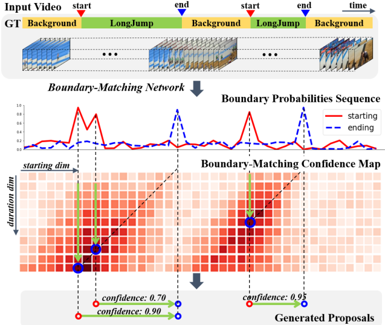

# BMN: Boundary-Matching Network

This repo is a PyTorch __reimplementation__ of the ICCV 19 paper "BMN: Boundary-Matching Network for Temporal Action Proposal Generation", which can be accessed on [[ArXiv]](https://arxiv.org/abs/1907.09702).

The repo is under construction.

Currently only the network and BM layer is implemented. You can run `python3 models.py` for a quick test.

# Progress
- [x] BM layer and BMN network
- [ ] Training code
- [ ] Trained model and inference code

# Prerequisites
- Python3
- Pytorch 

# Paper Introduction

 

BMN achives the temporal action proposal task with and end-to-end network. Upon the backbone are two parallel heads. One performs boundary detection by predicting probalities of being an action start/end for each location, the detected boundaries are later grouped into action segments. The other branch predicts a Boundary-Matching Confidence Map that encodes the confidence scores of predefined proposals. During inference, we can directly look up the confidence scores for each action segments in the BM Map without re-evaluate these segments, therefore the whole framework is very efficient.
